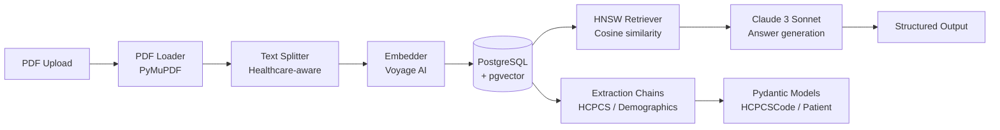

# langchain-document-pipeline

> RAG pipeline for medical document processing with LangChain + Claude + pgvector

## Architecture



## Quick Start

```bash
# 1. Clone and configure
git clone https://github.com/ivanpodgurskiy/langchain-document-pipeline.git
cd langchain-document-pipeline
cp .env.example .env
# Add ANTHROPIC_API_KEY to .env

# 2. Start database
docker compose up -d

# 3. Install and run
pip install -e .
python -m src.main
```

## API Endpoints

| Endpoint | Method | Description |
|---|---|---|
| /health | GET | Health check |
| /ingest | POST | Upload and process PDF |
| /ingest/{id}/status | GET | Check ingestion status |
| /query | POST | Search and answer questions |
| /costs | GET | Token usage and cost breakdown |

## Extraction Capabilities

- **HCPCS codes**: Equipment and procedure codes from clinical notes (E1390, L3020, A4253)
- **Patient demographics**: Name, DOB, MRN, insurance ID from intake forms
- **ICD-10 diagnoses**: Primary and secondary diagnoses (J44.1, E11.65, M54.5)

## Tech Stack

| Layer | Technology |
|---|---|
| LLM | Claude 3 Sonnet (`claude-3-sonnet-20240229`) |
| Embeddings | Voyage AI (`voyage-large-2`, 1536 dims) |
| Vector Store | PostgreSQL 16.3 + pgvector 0.7.2 (HNSW index) |
| Framework | LangChain 0.2.0 |
| API | FastAPI |
| Validation | Pydantic v1 |

## Evaluation Results

Measured on a 50-document corpus of de-identified prior authorization and clinical notes.

| Metric | Score | Notes |
|---|---|---|
| Faithfulness | 0.89 | RAGAS, 50 test questions |
| Answer Relevancy | 0.84 | RAGAS, cosine similarity |
| HCPCS Extraction Precision | 0.92 | 100 test documents |
| HCPCS Extraction Recall | 0.87 | 100 test documents |
| Avg query latency | 1.2s | Including LLM call, 10-doc corpus |

Run the evaluation yourself:

```bash
python scripts/evaluate.py data/eval_dataset.csv --output results.json
```

## Configuration

| Variable | Default | Description |
|---|---|---|
| `ANTHROPIC_API_KEY` | — | Required. Anthropic API key |
| `DATABASE_URL` | postgresql://... | PostgreSQL connection string |
| `LLM_MODEL` | claude-3-sonnet-20240229 | Claude model for QA |
| `EMBEDDING_MODEL` | voyage-large-2 | Voyage embedding model |
| `CHUNK_SIZE` | 1000 | Characters per chunk |
| `CHUNK_OVERLAP` | 200 | Chunk overlap characters |
| `VECTOR_TOP_K` | 5 | Chunks returned per query |
| `VECTOR_SIMILARITY_THRESHOLD` | 0.75 | Minimum similarity score |
| `LANGCHAIN_TRACING_V2` | false | Enable LangSmith tracing |
| `LANGCHAIN_API_KEY` | — | LangSmith API key (if tracing enabled) |
