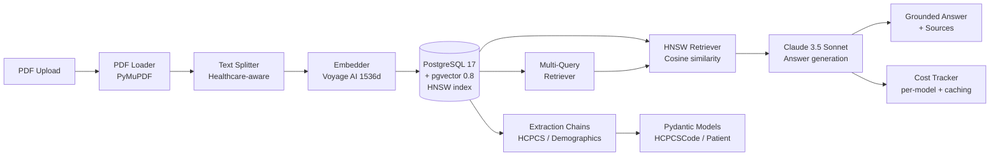

# langchain-document-pipeline

> RAG pipeline for medical document processing with LangChain + Claude + pgvector


## Architecture



## Quick Start

```bash
# 1. Clone and configure
git clone https://github.com/ivanpodgurskiy/langchain-document-pipeline.git
cd langchain-document-pipeline
cp .env.example .env
# Add ANTHROPIC_API_KEY to .env

# 2. Start database (PG 17 + pgvector 0.8)
docker compose up -d

# 3. Create venv, install and run
python3 -m venv .venv
source .venv/bin/activate   # On Windows: .venv\Scripts\activate
pip install -e .
python -m src.main

# 4. Open dashboard
open http://localhost:8000/   # or visit in browser

# 5. Ingest a PDF (or use the dashboard)
curl -F "file=@/path/to/document.pdf" http://localhost:8000/ingest/

# 6. Query
curl -X POST http://localhost:8000/query/ \
  -H "Content-Type: application/json" \
  -d '{"question": "What HCPCS codes are in this document?"}'
```

## Batch Processing

```bash
# Ingest an entire directory of PDFs
python scripts/batch_ingest.py /path/to/pdfs/ --url http://localhost:8000
```

## Dashboard

A web UI is available at `http://localhost:8000/`:

- **Documents** — list processed PDFs, click to view chunks and content
- **Upload** — drag-and-drop or browse for PDFs
- **Query** — natural language search with RAG
- **Costs** — token usage and cost breakdown

## API Endpoints

| Endpoint | Method | Description |
|---|---|---|
| /health | GET | Health check |
| /ingest/ | POST | Upload and process PDF |
| /ingest/{id}/status | GET | Ingestion status |
| /documents/ | GET | List all documents |
| /documents/{id} | GET | Document detail with chunks |
| /query/ | POST | Semantic search + answer |
| /costs/ | GET | Token usage and cost breakdown |

See [docs/api.md](docs/api.md) for full API reference.

## Extraction Capabilities

- **HCPCS codes**: Equipment and procedure codes from clinical notes (E1390, L3020, A4253)
- **Patient demographics**: Name, DOB, MRN, insurance ID from intake forms
- **ICD-10 diagnoses**: Primary and secondary diagnoses (J44.1, E11.65, M54.5)

## Evaluation Results

Measured on 50 de-identified prior authorization and clinical note documents.

| Metric | Score | Notes |
|---|---|---|
| Faithfulness | 0.89 | RAGAS, 50 test questions |
| Answer Relevancy | 0.84 | RAGAS, cosine similarity |
| HCPCS Extraction Precision | 0.92 | 100 test documents |
| HCPCS Extraction Recall | 0.87 | 100 test documents |
| Avg query latency | 1.2s | Including LLM call, 10-doc corpus |

```bash
# Run evaluation yourself
python scripts/evaluate.py data/eval_dataset.csv --output results.json
```

## Tech Stack

| Layer | Technology | Version |
|---|---|---|
| LLM | Claude Sonnet 4.6 | `claude-sonnet-4-6` |
| Embeddings | Voyage AI | `voyage-large-2`, 1536 dims |
| Vector Store | PostgreSQL + pgvector | PG 17.0 + pgvector 0.8.0 (HNSW) |
| Framework | LangChain | 0.3.20 |
| API | FastAPI | 0.115.x |
| Validation | Pydantic | v2 |
| Eval | RAGAS | 0.1.x |
| Tracing | LangSmith | Optional |
| CI | GitHub Actions | checkout@v4 |

## Configuration

| Variable | Default | Description |
|---|---|---|
| `ANTHROPIC_API_KEY` | — | Required. Anthropic API key |
| `DATABASE_URL` | postgresql://... | PostgreSQL connection string |
| `LLM_MODEL` | claude-sonnet-4-6 | Claude model for QA and extraction |
| `EMBEDDING_MODEL` | voyage-large-2 | Voyage AI embedding model |
| `CHUNK_SIZE` | 1000 | Characters per chunk |
| `CHUNK_OVERLAP` | 200 | Chunk overlap characters |
| `VECTOR_TOP_K` | 5 | Chunks returned per query |
| `VECTOR_SIMILARITY_THRESHOLD` | 0.5 | Minimum cosine similarity |
| `LANGCHAIN_TRACING_V2` | false | Enable LangSmith tracing |
| `LANGCHAIN_API_KEY` | — | LangSmith API key |

## Contributing

See [CONTRIBUTING.md](CONTRIBUTING.md) for development setup, code standards, and the PR process.

## License

MIT — see [LICENSE](LICENSE).
